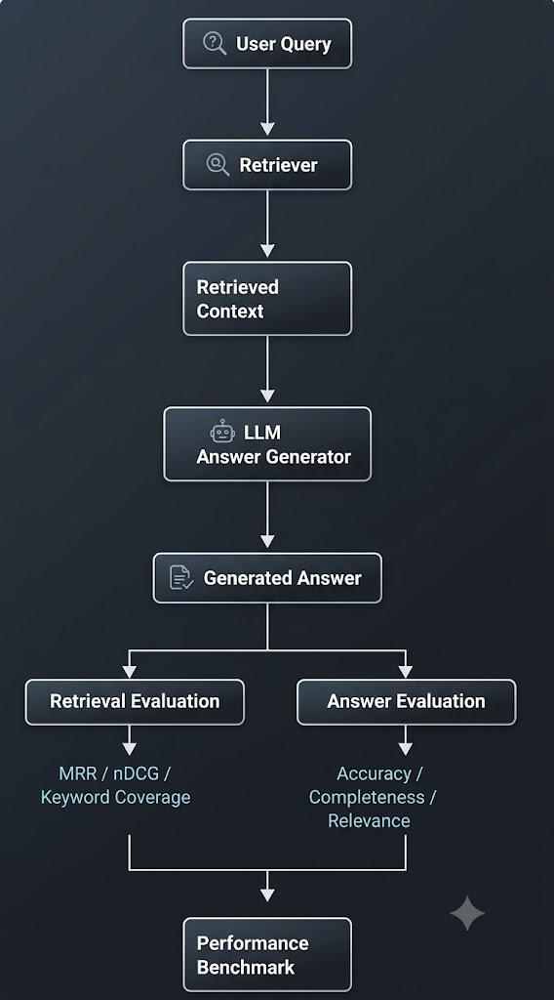

# Automated RAG Engine Performance Benchmarker

An automated framework for evaluating and benchmarking **Retrieval-Augmented Generation (RAG)** systems. The project evaluates both **retrieval quality** and **LLM-generated answer quality**, helping identify whether performance issues originate from retrieval or generation.

The system provides an interactive interface for running a RAG pipeline and automatically measuring its performance using metrics such as **MRR, nDCG, keyword coverage, accuracy, completeness, and relevance**.

## Pipeline

  

